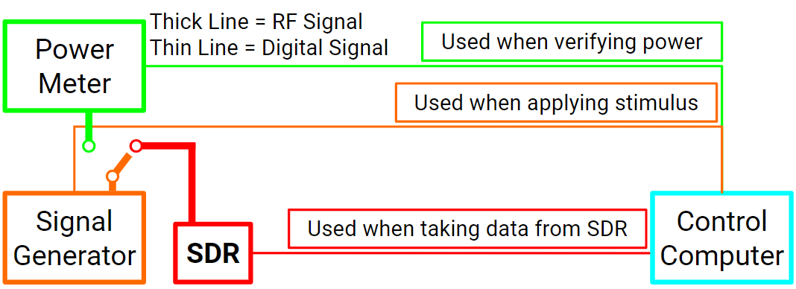
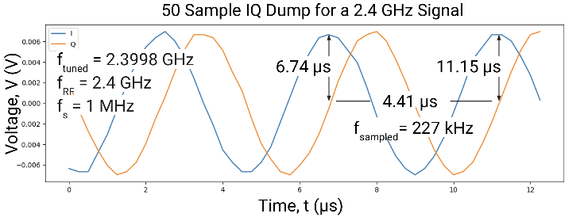
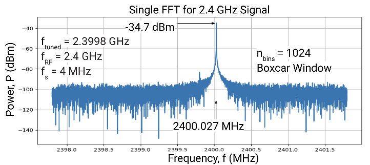

# Introduction 

_This software is under active development and is being released "as-is" for collaboration. It may not be fully functional and should be considered as an alpha release. We welcome community feedback for the repository!_

This readme contains a brief descripton of the sdrcalibrator codebase intended to enable the automated calibration of Software Defined Radios (SDRs). This readme contains 
- description of github repository contents
- brief installation guide 
- [quick start](#quick-start-with-adalm-pluto) describing code structure and how to run basic tests

In addition to the documentation in this readme, there is a [repository wiki](https://github.com/NTIA/sdrcalibrator/wiki) that provides a thorough description of codebase and test functionality. 

The premise behind sdrcalibrator is to enable SDR calibration that can be automated. The use of Conitnuous Wave (CW) calibration removes the need for a calibrated noise diode which is often invalid over the whole range of SDR operation. By using a CW, sdrcalibrator eliminates the need for switching between noise diodes to characterize SDR behavior over its whole range of operation.

## Repository Contents 
- [sdr_calibrator.py](https://github.com/NTIA/sdrcalibrator/blob/main/sdr_calibrator.py) is run for any tests
- Test profiles in the profiles folder define test parameters (see the [Experiment and Measurement Profiles Section](#experiment-and-measurement-profiles) for more)
- Equipment Classes in [sdrcalibrator/lib/equipment](https://github.com/NTIA/sdrcalibrator/tree/updating-documentation/sdrcalibrator/lib/equipment) define equipment modules and behavior
- Tests in [sdrcalibrator/lib/scripts](https://github.com/NTIA/sdrcalibrator/tree/updating-documentation/sdrcalibrator/lib/scripts) define test functionality
- [plot_iq.py](https://github.com/NTIA/sdrcalibrator/blob/main/plot_iq.py) and [single_fft_var.py](https://github.com/NTIA/sdrcalibrator/blob/main/single_fft_var.py) are helpers that can be used to plot the results of IQ dump tests and single FFT tests from results files saved in test logs generated after running a est

# Installation 

## Environment Requirements 
This codebased was developed on a Linux operating system to facilitate the use of Tektronics equipment drivers requiring a Linux operating sysem. It may be possible to use this codebase on different operating systems exlcuding the use of SDRs that require Linux, but that functionality has not been tested by these authors. 

## Required Packages
---------------------
### Installable with pip
Listed in pip_requirements.txt, installable with `pip_install pip_requirements.txt`

### Installable with apt-get
Listed in apt-get_requirements.txt, installable with 
``` apt-get install `cat apt-get_requirements.txt` ```     

### Requires Separate Installation
Some SDR device drivers (e.g., for the ADALM-Pluto, used in the quickstart) require installation outside the package manager. If there are issues with running tests with a particular device, check to see if its drivers are installed properly by referencing manufacturer documentation. Please contact our support team if you have questions regarding our experience with using any particular device. 

### Installing Python Packages
Required python dependencies can be found in the files apt-get_requirements.txt and pip_requirements.txt. This author was unable to install the apt-get requirements using the requirements file, but because the packages which require apt-get installation are few it doesn't take long to install them individually using `sudo apt-get install [PACKAGENAME]`. Packages with available pip installation can be installed all at once by running `pip install -r pip_requirements.txt` in the top-level SDR calibrator directory. 

Some specific equipment modules (e.g. [ADALM2000](https://www.analog.com/en/design-center/evaluation-hardware-and-software/evaluation-boards-kits/adalm2000.html)) require additional drivers which need to be installed manually. Some minimal install instructions along with direction to manufacturer documentation can be found in the equipment class definitions. 

### Using SDR Calibrator with a conda virtual environment 
For those desiring to use a conda virtual enviornment to run SDR calibrator, GNU Radio recommends using [radioconda](https://wiki.gnuradio.org/index.php/CondaInstall#Installation_using_radioconda_(recommended)), but this does not seem to work with SDR calibrator as configured.

# Usage
## Experiment and Measurement Profiles
---------------------
Running a measurement in SDR calibrator relies on profiles to define all the experiment and measurement parameters. The experiment profile,  `profiles/experiment.profile`, defines the set of parameters that will stay constant throughout a series of different measurements (e.g. equipment connections, sdr specification). The measurement profile (copied from `profiles/examples/*.profile`) defines the parameters for a specific measurement (e.g. center frequency, sample rate, gain) and can change from one run of a test to another. 

Setup of a profile should be the only requirement to define the test parameters. The program should select default parameters where possible and alert the user when it cannot. The test is defined with the `TEST_type` profile parameter. This parameter should match the test filename in `./lib/scripts/` to properly load a test.

A detailed parameter list and descriptions of each for each available test can be found in the [repository wiki](https://github.com/NTIA/sdrcalibrator/wiki). You can also find a list of parameters in the `./lib/scripts/SDR_[test_type].py` file for each test. All attempts to make these as intuitive as possible were made. Note: FFT_number_of_bins is equivalent to the number of points taken for each FFT.

The device drivers in './lib/equipment' may have additional dependencies depending on how they are connected to the controlling computer. For example:
1. `./lib/equipment/sdr/b210.py` uses GNU Radio
2. `./lib/equipment/siggen/e8662b.py` uses PyVisa
3. `./lib/equipment/switch/x300.py` uses a webinterface
These dependencies must be installed based on the drivers being used. For the ADALM-Pluto, the dependencies are referenced in the quick start guide. A full list of dependencies for supported equipment is forthcoming.

## Defining Custom Tests
---------------------
Custom tests can be added relatively easily by adding the corresponding test file to the `./lib/scripts/` directory. Each test should have the following functions defined and each of these functions should call the super function as its last operation except in the case of `run_test()` and `save_data()`.

1. __init__(self,profile,from_other_test=False,logger=None)
2. check_profile(self)
3. initialize_test(self)
4. initialize_equipment(self)
5. run_test(self)
6. save_data(self)
7. cleanup(self)

All controlling of equipment should be done in the `run_test()` function so that other tests can call the test properly. Saving data can be done in `save_data()`, where it will be saved after completion of the test, or `run_test()`, where it will be saved during the run (advisable if quite a bit of data will be generated). Care should be taken to when saving data in the `run_test()` function as the additional save files may be generated if the test is called from another.


# Quick Start with ADALM-Pluto
These steps can be replicated with the RTL SDR if preferred, replacing the ADALM-Pluto driver and python API installation with RTL SDR software support installation.
1. Install ADALM-Pluto Drivers following [installation guide](https://wiki.analog.com/university/tools/pluto/users)
2. Install ADALM-Pluto ptyon libraries `sudo pip install pylibiio==0.23.1`
3. Setup equipment consistent with the following block diagram

4. Modify the top-level profile from `profiles/experiment.profile ` to fit your needs
4. Copy a profile from `profiles/examples/*.profile` to `profiles/*.profile` and modify to your needs for an individual measurement
5. Run `./sdr_calibrator.py ./profiles/*.profile`
6. If set, the data will be output (along with profile file to run an identical test) to `./test_results/` under a folder identified by the date/time of the test and which type of test was run


# Defining New Equipment

All that must be done to define a new piece of equipment is to write a short driver. In the absence of more documentation on this (which is forthcoming), the easiest way to do this is to copy an existing piece of equipment of the same category, e.g. `sdrcalibrator/lib/eqipment/sdr/mock_sdr.py`, then rewriting the functions inside the class.

<!-- TODO: add more detail to these instructions -->

## SDR requirements
SDR should be accessible via python interface. If you would like to add your own SDR Module, please include references to SDR driver installation and any other necessary setup documentation in the comments of your SDR class file. 

## Setting up the class file 
use `sdrcalibrator/lib/equipment/sdr/mock_sdr.py` as an example.

## Implementing the functions
List of methods that need to be implemented based on SDR usage 
- connect, used to get serial number for connection and set any other SDR-specific varibales that will be used in other methods 
- set_clock_frequency, should include checks to see what the bounds should be


# Functionality Description with ADALM-Pluto
This section includes a demo of the key functionalities of SDR Calibrator using an RTL SDR and the Lab setup at NTIA-ITS. 

## Setup Calibration 
The purpose of setup calibration ([./profiles/examples/calibrate.profile](./profiles/examples/calibrate.profile), [./sdrcalibrator/lib/scripts/setup_calibration.py](./sdrcalibrator/lib/scripts/setup_calibration.py)) is to 

- do a noise floor measurement 
- measure equivalent noise bandwidth
- remove the SDR and all intervening cables from power measurements. The calibration procedure calculates a series of offsets between different ports to set the power reference to after the SDR ADC. 

### Required Equipment 
- Power Meter 
- Signal Generator (Siggen)
- Design Under Test (DUT), the SDR to be Calibrated

### Optional Equipment
- Power Verification with similar dynamic range to the DUT*
- RF Switch*

The code was originally written to include a power verification device and RF switch to verify power measured by the SDR in setup calibration. This functionality is now largely deprecated. If not using an RF switch and power verification device, replace the switch module with "mock_switch" in the experiment profile. 

### Procedure

#### Noise floor measurement 
Beginning part of the document under sweep parameters

#### Power Offset Calibration

There are 4 ports that are calibrated in this procedure. Each calibration calculates the DC offset between ports. The table below shows each port and its designation. 

| Port Number | Port Description                |
|-------------|---------------------------------|
| 0           | Siggen Setting                  |
| 1           | Siggen Output                   |
| 2           | SDR Input                       |
| 3           | Power Verification Input        |

The calibration procedure involves measuring the power of each port relative to the siggen setting. The result of each measurement is a correction factor used to calculate power after the SDR ADC. The program will walk through the steps to take measurrements to calculate each correction factor, and the procedure is summarized below:
| Port Number | Measurement                                     | Correction Factor | Purpose                                                               |
|-------------|-------------------------------------------------|-------------------|-----------------------------------------------------------------------|
| 0           | Record Power Level from Siggen Setting          | n/a               | Set Power Reference for System                                        |
| 1           | Measure Power Level at Siggen Output            | c10               | Calculate Siggen power output                                         |
| 2           | Measure Power Level at DUT Input                | c20               | Calculate power at input to DUT                                       |
| 3           | Measure Power Level at Power Verification Input | c30               | Use difference between c20 and c30 to determine power drop across DUT |

## IQ Dump
### Required Equipment
- DUT
- Signal Source

### Description
The IQ dump routine ([./profiles/examples/iq_dump.profile](./profiles/examples/iq_dump.profile), [./sdrcalibrator/lib/scripts/iq_dump.py](./sdrcalibrator/lib/scripts/iq_dump.py))
is one of the core functionalities of SDR calibrator on which every other routine is based, and its functionality is to simply take IQ data from the DUT.

Its functionality verification is based on the principle that a CW signal will be sampled as a CW signal whose frequency is the difference between the signal frequency and sample frequency. The figure below shows the IQ dump for a 2.4 GHz signal sampled with a 2.3998 GHz center frequency.



The resulting I signal has a peak at 6.74 &mu;s and another peak at 11.15 &mu;s. This corresponds to a period of 4.41 &mu;s, or a frequency of 227 kHz, which is roughly the 200  kHz offset from baseband. This verifies that IQ dump behaves as needed.


## Single FFT
### Required Equipment
- DUT
- Signal Source

### Description
The single FFT routine ([./profiles/examples/single_fft.profile](./profiles/examples/single_fft.profile), [./sdrcalibrator/lib/scripts/single_fft.py](./sdrcalibrator/lib/scripts/single_fft.py)) forms the basis for routines such as the power measurement test and  spectrum sweep. It takes IQ data using the iq_dump routine and calculates a spectral estimate using [Bartlett's method](https://en.wikipedia.org/wiki/Bartlett%27s_method). The `fft_number_of_bins`parameter in the experiment/measurement profiles sets the number of bins in the periodogram and the `fft_averaging_number` parameter sets the number of periodograms to average. Generally, default averaging number is 1.

The figure below shows single FFT run with 1024 bins for the same signal measured in IQ dump, with a clear peak in signal power at 227. 


A proper spectrogram will show a decreasing noise variance for an increasing number of FFT bins. Re-running single FFT with 128, 1024, and 8192 bins yields the following variance in units of V<sup>2</sup>, assuming R = 50 &Omega;:

| Number of FFT Bins | FFT Noise Variance (V^2) |
|----------------|--------------------------|
| 128            | 3.107 e-11                |
| 1024           | 2.207 e-12                |
| 8192           | 3.270 e-13                |

This shows that as the number of FFT bins increases, the nosie variance decreases, as expected for a properly executed FFT. 

<!-- ### Required Equipment 
- DUT
- Signal Source 

## Power Measurement Test -->


# Support
Todd Schumann    | NTIA/Institute for Telecommunication Sciences | tschumann@ntia.gov

AJ Cuddeback    | NTIA/Institute for Telecommunication Sciences | acuddeback@ntia.gov

# License 
See [LICENSE](LICENSE.md).
