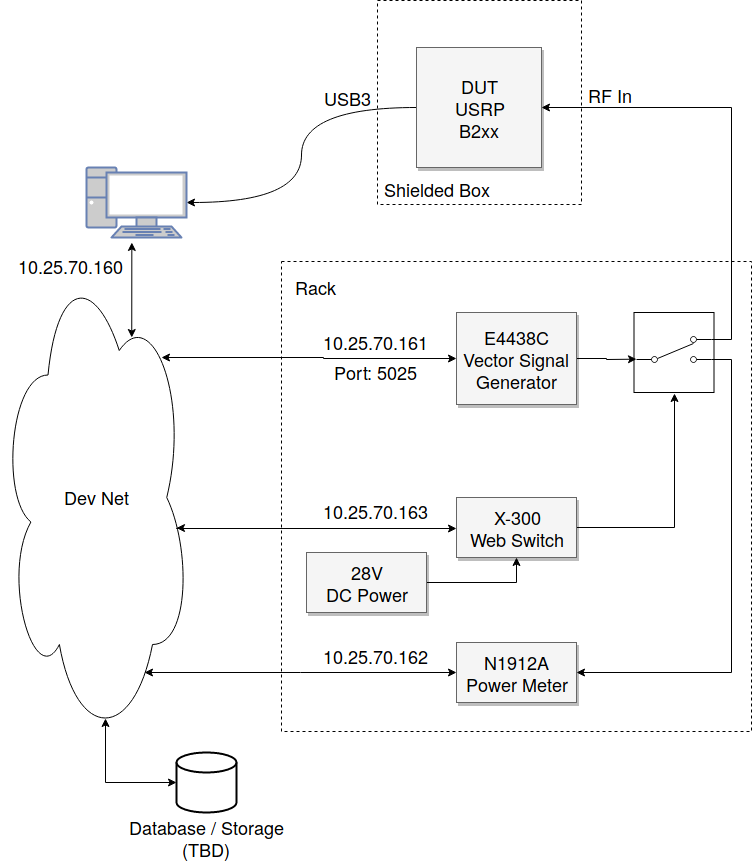

# USRP Calibrator
===============

USRP Calibrator provides power calibration and other test utilities for USRP software defined radio using VISA-compatible test equipment.

## Project Structure
Eventually I'll add a class that we can use to populate the defaults file more easily. 

### Instrument Objects 
Instrument classes should the same universal to anyone running the code from this repository. The values in the instrument objects are based on hardware specifications, and will not change between experiments. 

### Defaults File
The file `defaults.py` contains the defaults for a given experiment. It will be populated using parameters from the instrument objects, as well as user-chosen default values for calibration. This file should be edited to reflect the general operating assumptions that apply to the typical measurement to be taken during the experiment. 
NOTE: IF defaults profile overwrites any sdr default values, the indivudal test profile has to explicitly set a value. Anything that is defined in the defaults profile has to have a corresponding definition in the individual profile(unless I do the inheritance thing. That will get rid of that need. That way, test profile will just overwrite things)

#### SDR Parameters


#### Network Parameters


#### Logging Parameters
fill out with what each one is, what should be defaults probably
- `logging_quiet_mode`
- `logging_save_log_file` 
- `logging_save_test_summary`
- `logging_save_fft_data`
- `logging_save_iq_data`
- `logging_plot_fft`

ERRORS FOUND: 
- logging_save_log_file = True has substring not found error, how do we use it?


### Profiles 
The `.profile` files specify the configuration for an individual measurement. In many cases, they may be exactly the same as the configuration specified in `defaults.py`. If, however, one wished to take one measurement with a different group of settings than those for the other measurements, those should be specified on the profile-level.

## Required Packages
### Installable with pip
Listed in pip_requirements.txt, installable with `pip_install pip_requirements.txt`

### Installable with apt-get
Listed in apt-get_requirements.txt, installable with 
``` apt-get install `cat apt-get_requirements.txt` ```     

### Requires Separate Installation
This section is for instructions on how to install software that is not available through python package managers, e.g. some SDR driver software.

## Quick Start with the Ettus B210
-------------------------------

1. Install the necessary libraries:
`sudo apt-get install gnuradio-dev libuhd-dev python-numpy python-matplotlib python-pip`

2. Install the necessary Python libraries:
`sudo pip install pyvisa-py`
3. Setup equipment simliar to the following block diagram

4. Copy a profile from `profiles/examples/*.profile` to `profiles/*.profile` and modify to your needs.
**WARNING:** Notice there is not a 30dB attenuator after the signal generator in the example setup. If an attenuator is used, the value can be set in the test profiles or set to 0 if there is no attenuator. If not using an attenuator, be very careful with the power levels (it is recommended to always use the power limit checks) to ensure the USRP is not damaged.
5. Run `./sdr_calibrator.py ./profiles/*.profile`
6. If set, the data will be output (along with profile file to run an identical test) to `./test_results/` under a folder identified by the date/time of the test and which type of test was run

## Detailed Usage
--------------

Setup of a profile should be the only requirement to define the test parameters. The program should select default parameters where possible and alert the user when it cannot. The test is defined with the `TEST_type` profile parameter. This parameter should match the test filename in `./lib/scripts/` to properly load a test.

A detailed parameter list and descriptions of each for each available test is forthcoming. In the meantime, you can find a list of parameters in the `./lib/scripts/SDR_[test_type].py` file for each test. All attempts to make these as intuitive as possible were made. Note: FFT_number_of_bins is equivalent to the number of points taken for each FFT.

The device drivers in './lib/equipment' may have additional dependencies depending on how they are connected to the controlling computer. For example:
1. `./lib/equipment/sdr/b210.py` uses GNU Radio
2. `./lib/equipment/siggen/e8662b.py` uses PyVisa
3. `./lib/equipment/switch/x300.py` uses a webinterface
These dependencies must be installed based on the drivers being used. A full list of dependencies if forthcoming.

More detailed usage procedures will be written once the program flow is finalized.

## Defining Custom Tests
---------------------

Custom tests can be added relatively easily by adding the corresponding test file to the `./lib/scripts/` directory. Each test should have the following functions defined and each of these functions should call the super function as its last operation except in the case of `run_test()` and `save_data()`.

1. __init__(self,profile,from_other_test=False,logger=None)
2. check_profile(self)
3. initialize_test(self)
4. initialize_equipment(self)
5. run_test(self)
6. save_data(self)
7. cleanup(self)

All controlling of equipment should be done in the `run_test()` function so that other tests can call the test properly. Saving data can be done in `save_data()`, where it will be saved after completion of the test, or `run_test()`, where it will be saved during the run (advisable if quite a bit of data will be generated). Care should be taken to when saving data in the `run_test()` function as the additional save files may be generated if the test is called from another.

<!-- TODO: Add more info on how to add more tests -->

## Defining New Equipment
----------------------

All that must be done to define a new piece of equipment is to write a short driver. In the absence of more documentation on this (which is forthcoming), the easiest way to do this is to copy an existing piece of equipment of the same category, then rewriting the functions inside the class.

<!-- TODO: add more detail to these instructions -->

### SDR requirements
SDR should be accessible via python interface. 

For this example, we will use the ADALM2000. If you would like to add your own SDR Module, please include references to SDR driver installation and any other necessary setup documentation in the comments of your SDR class file. 

### Setting up the class file 
use `sdrcalibrator/lib/equipment/sdr/mock_sdr.py` as an example.

## Implementing the functions
List of methods that need to be implemented based on SDR usage 
- connect, used to get serial number for connection and set any other SDR-specific varibales that will be used in other methods 
- set_clock_frequency, should include checks to see what the bounds should be

Support
-------
Todd Schumann    | NTIA/Institute for Telecommunication Sciences | tschumann@ntia.gov

AJ Cuddeback    | NTIA/Institute for Telecommunication Sciences | acuddeback@ntia.gov

Legal
-----
See [LICENSE](LICENSE.md).


## Profile Structure
### Experiment Profile

### Test Profile 

### Measurement Profile

### Running the

## Notes on the call stack
1. sdr_calibrator.py loads the profile and calls utils.execute_test with the profile as a parameter 
2. execute_test uses the profile to determine which type of test to run 
    - execute_test loads the appropriate test function as an SDR_Test object using import_object(test_script, "SDR_Test")
    - the test is defined as test_function(profile)
    - i.e., the profile is used to determine which function to use and then is passed as a parameter to the function to define the test
    - test.run() runs the test -> runs the .test() method of the SDR_Test Class

### SDR_TEST object 
Defined in utils sdr_test_class.py 