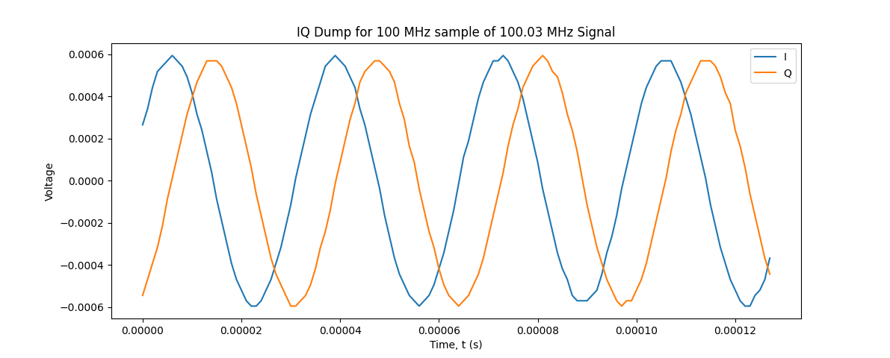
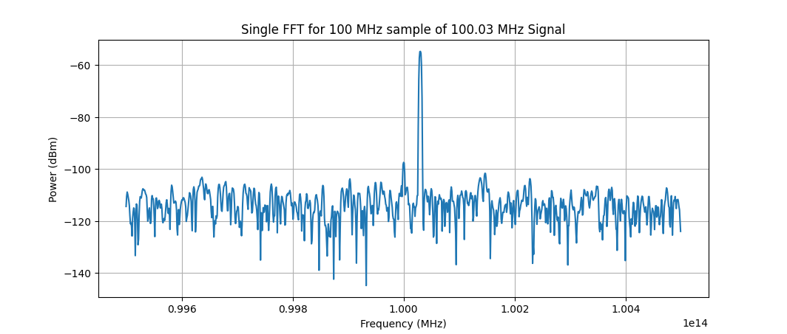

# Introduction 

## Installation 
### Clone Github Repo

### Install Dependencies 
The python dependencies required for SDR calibrator can be installed in one of two ways: install through a package manager (e.g. [pip](https://pypi.org/project/pip/)) or manual install. All packages required to run SDR calibrator with an [RTL SDR](https://www.rtl-sdr.com/) and the equipment used in the quickstart can be installed via package manager. 

#### Installing Python Packages
Required python dependencies can be found in the files apt-get_requirements.txt and pip_requirements.txt. This author was unable to install the apt-get requirements using the requirements file, but because the packages which require apt-get installation are few it doesn't take long to install them individually using `sudo apt-get install [PACKAGENAME]`. Packages with available pip installation can be installed all at once by running `pip install -r pip_requirements.txt` in the top-level SDR calibrator directory. 

Some specific equipment modules (e.g. [ADALM2000](https://www.analog.com/en/design-center/evaluation-hardware-and-software/evaluation-boards-kits/adalm2000.html)) require additional drivers which need to be installed manually. Some minimal install instructions along with direction to manufacturer documentation can be found in the equipment class definitions. 

#### Using SDR Calibrator with a conda virtual environment 
For those desiring to use a conda virtual enviornment to run SDR calibrator, GNU Radio recommends using [radioconda](https://wiki.gnuradio.org/index.php/CondaInstall#Installation_using_radioconda_(recommended)), but this does not seem to work with SDR calibrator as configured. 

# Quick Start with RTL SDR 
This section includes a demo of the key functionalities of SDR Calibrator using an RTL SDR and the Lab setup at NTIA-ITS. 

# Setup Calibration 
The purpose of setup calibration ([./profiles/examples/calibrate.profile](./profiles/examples/calibrate.profile), [./sdrcalibrator/lib/scripts/setup_calibration.py](./sdrcalibrator/lib/scripts/setup_calibration.py)) is to 

- do a noise floor measurement 
- measure equivalent noise bandwidth
- remove the SDR and all intervening cables from power measurements. The calibration procedure calculates a series of offsets between different ports to set the power reference to after the SDR ADC. 

## Required Equipment 
- Power Meter 
- Signal Generator (Siggen)
- Design Under Test (DUT), the SDR to be Calibrated

## Optional Equipment
- Power Verification with similar dynamic range to the DUT*
- RF Switch*

The code was originally written to include a power verification device and RF switch to verify power measured by the SDR in setup calibration. This functionality is now largely deprecated. If not using an RF switch and power verification device, replace the switch module with "mock_switch" in the experiment profile. 

## Procedure

### Noise floor measurement 
Beginning part of the document under sweep parameters

### Power Offset Calibration

There are 4 ports that are calibrated in this procedure. Each calibration calculates the DC offset between ports. The table below shows each port and its designation. 

| Port Number | Port Description                |
|-------------|---------------------------------|
| 0           | Siggen Setting                  |
| 1           | Siggen Output                   |
| 2           | SDR Input                       |
| 3           | Power Verification Input        |

The calibration procedure involves measuring the power of each port relative to the siggen setting. The result of each measurement is a correction factor used to calculate power after the SDR ADC. The program will walk through the steps to take measurrements to calculate each correction factor, and the procedure is summarized below:
| Port Number | Measurement                                     | Correction Factor | Purpose                                                               |
|-------------|-------------------------------------------------|-------------------|-----------------------------------------------------------------------|
| 0           | Record Power Level from Siggen Setting          | n/a               | Set Power Reference for System                                        |
| 1           | Measure Power Level at Siggen Output            | c10               | Calculate Siggen power output                                         |
| 2           | Measure Power Level at DUT Input                | c20               | Calculate power at input to DUT                                       |
| 3           | Measure Power Level at Power Verification Input | c30               | Use difference between c20 and c30 to determine power drop across DUT |

# IQ Dump

## Description
The IQ dump routine ([./profiles/examples/iq_dump.profile](./profiles/examples/iq_dump.profile), [./sdrcalibrator/lib/scripts/iq_dump.py](./sdrcalibrator/lib/scripts/iq_dump.py)) 
is one of the core functionalities of SDR calibrator on which every other routine is based, and its functionality is to simply take IQ data from the DUT. 

Its functionality verification is based on the principle that a CW signal will be sampled as a CW signal whose frequency is the difference between the signal frequency and sample frequency. The figure below shows the IQ dump for a 100.03 MHz signal sampled at 100 MHz.

 

The resulting I signal has a peak at 47.3 &mu;s and another peak at 80.9 &mu;s. This corresponds to a period of 33.6 &mu;s, or a frequency of 29.8 kHzz, which is roughly the 30 kHz offset from baseband. This verifies that IQ dump behaves as needed. 

## Required Equipment 
- DUT
- Signal Source 

# Single FFT
## Description
The single FFT routine ([./profiles/examples/single_fft.profile](./profiles/examples/single_fft.profile), [./sdrcalibrator/lib/scripts/single_fft.py](./sdrcalibrator/lib/scripts/single_fft.py)) forms the basis for routines such as the power measurement test and  spectrum sweep. It takes IQ data using the iq_dump routine and calculates a spectral estimate using [Bartlett's method](https://en.wikipedia.org/wiki/Bartlett%27s_method). The `fft_number_of_bins`parameter in the experiment/measurement profiles sets the number of bins in the periodogram and the `fft_averaging_number` parameter sets the number of periodograms to average. Generally, default averaging number is 1.

The figure below shows single FFT run with 1024 bins for the same signal measured in IQ dump, with a clear peak in signal power at 30 kHz. 

A proper spectrogram will show a decreasing noise variance for an increasing number of FFT bins. Re-running single FFT with 128, 1024, and 8192 bins yields the following variance in units of V2, assuming R = 50 &Omega;:

| Number of FFT Bins | FFT Noise Variance (V^2) |
|----------------|--------------------------|
| 128            | 1.19 e-12                |
| 1024           | 1.72 e-13                |
| 8192           | 2.35 e-14                |

This shows that as the number of FFT bins increases, the nosie variance decreases, as expected for a properly executed FFT. 

## Required Equipment 
- DUT
- Signal Source 

# Power Measurement Test